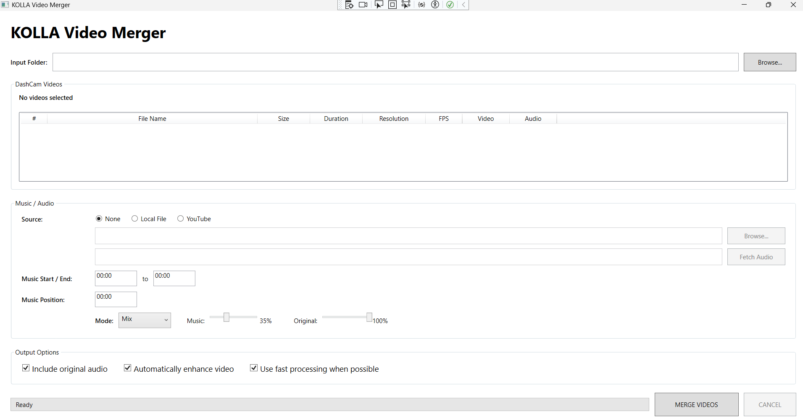
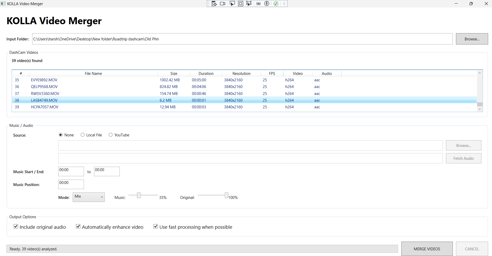
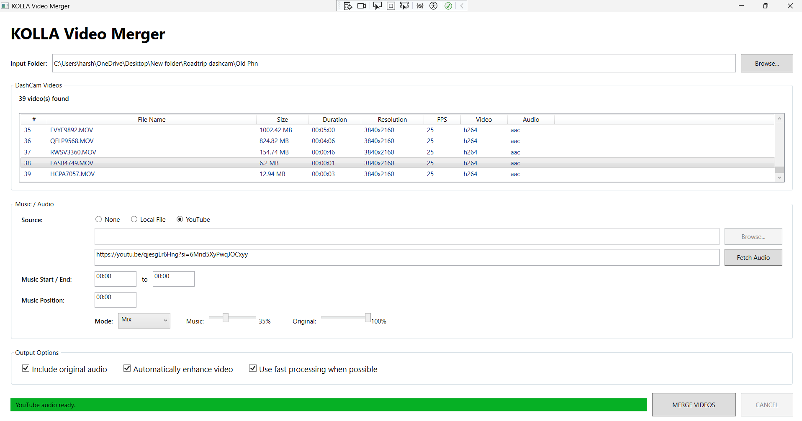
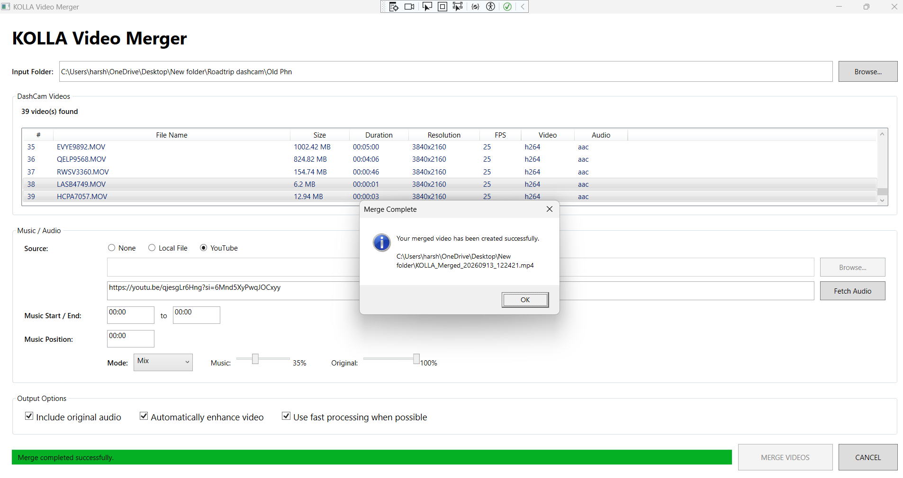

# KOLLA Video Merger

**A Windows desktop video-processing application built with C#/.NET 10, WPF, and FFmpeg.**

[](https://dotnet.microsoft.com/)
[](https://learn.microsoft.com/dotnet/csharp/)
[](https://learn.microsoft.com/dotnet/desktop/wpf/)
[](https://ffmpeg.org/)
[](https://www.microsoft.com/windows)
[](LICENSE)

> Merge, enhance, and process high-resolution video locally with a .NET desktop application designed around performance, reliability, and graceful hardware/software fallback.

---

## Overview

KOLLA Video Merger was built around a practical need: combine multiple high-resolution dash-cam recordings into a single MP4 without requiring a full-featured video editor.

The application provides a WPF interface over FFmpeg and FFprobe while handling media discovery, metadata inspection, video concatenation, optional enhancement, external audio, asynchronous processing, progress reporting, cancellation, and encoder fallback.

The project evolved beyond a simple FFmpeg wrapper as real-world testing exposed engineering challenges such as:

* High CPU usage during unnecessary 4K re-encoding
* Differences in hardware encoder availability across machines
* FFmpeg concat-file encoding issues
* Long-running process management and cancellation
* Partial-output and temporary-file cleanup
* External-audio processing edge cases

The result is a focused desktop application that demonstrates practical **C#/.NET application development, multimedia processing, performance optimization, hardware capability detection, asynchronous workflows, and defensive error handling**.

---

## Screenshots

### Main Window



### Video Selection



### Audio Processing



### Merge Progress



---

## Highlights

* 🎬 Merge multiple supported video files into one MP4
* 🔎 Inspect duration, resolution, FPS, video codec, and audio codec with FFprobe
* ⚡ Use a fast video-copy path when enhancement and external audio are not required
* 🚀 Detect and validate hardware H.264 encoders
* 🛡️ Fall back to `libx264` when hardware encoding is unavailable or fails
* 🎨 Apply brightness, contrast, saturation, and sharpening filters
* 🔊 Preserve original audio, replace it, or mix it with external audio
* 🎵 Use local audio files or fetch audio-only streams from a YouTube URL
* ✂️ Configure external-audio start/end trimming and placement
* 🔉 Control music and original-audio volume
* 📊 Display FFmpeg progress in the WPF UI
* ⛔ Cancel long-running processing and terminate the FFmpeg process tree
* 🧹 Clean up temporary files and partial output on cancellation or failure

---

## Features

### Video Merging

The application reads supported video files from an input folder and analyzes them with FFprobe before processing.

Supported input extensions currently include:

* `.mp4`
* `.mov`
* `.avi`
* `.mkv`
* `.mts`
* `.m2ts`

The video list displays metadata such as:

| Metadata    | Example        |
| ----------- | -------------- |
| File name   | `LVQK0279.MOV` |
| File size   | `39.73 MB`     |
| Duration    | `00:00:11`     |
| Resolution  | `3840x2160`    |
| FPS         | `25`           |
| Video codec | `h264`         |
| Audio codec | `aac`          |

At least two videos must be selected before merging.

---

### Fast Processing Path

When enhancement is disabled and external audio is not being processed, the merge service uses FFmpeg's video-copy path.

```text
Input videos
     │
     ▼
FFmpeg concat demuxer
     │
     ├── Video: copy
     └── Audio: copy / remove
     │
     ▼
Final MP4
```

This avoids unnecessary video re-encoding when the requested operation permits it.

For compatible inputs, this can dramatically reduce processing time and CPU usage compared with decoding and re-encoding 4K video.

---

### Video Enhancement

When enhancement is enabled, the application uses an FFmpeg filter pipeline:

```text
eq
 ├── contrast
 ├── brightness
 └── saturation

unsharp
 └── sharpening
```

The current implementation uses a fixed enhancement profile rather than exposing individual enhancement sliders.

Because enhancement requires decoding, filtering, and encoding, it is significantly more computationally expensive than the video-copy path.

---

### Hardware Encoder Detection

The application tests H.264 hardware encoders in this order:

```text
h264_nvenc
     ↓
h264_qsv
     ↓
h264_amf
     ↓
libx264
```

Rather than assuming an encoder works simply because FFmpeg reports its name, the application performs a small test encode to validate actual usability.

If a hardware encoder fails during the actual enhanced merge:

1. The partial output is removed.
2. The application retries using `libx264`.
3. Processing continues using software encoding when possible.

This makes the application more resilient across systems with different GPU hardware and driver configurations.

---

### Audio Processing

External audio can be:

* A local audio file
* Audio retrieved from a YouTube URL

The application supports:

* Start time
* End time
* Position in the final video
* Music volume
* Original-audio volume
* Mix mode
* Replace mode

The FFmpeg audio pipeline uses filters including:

```text
atrim
asetpts
volume
adelay
afade
apad
amix
```

where applicable.

---

### YouTube Audio

The application uses `YoutubeExplode` to retrieve an audio-only stream from a supplied YouTube URL.

Downloaded audio is stored temporarily under the user's temporary directory and is removed during cleanup.

> Use YouTube content only when you have the necessary rights or permission and in accordance with applicable service terms and laws.

---

### Progress Reporting

FFmpeg is launched with:

```text
-progress pipe:1
-stats_period 0.5
```

The service reads `out_time_us` and converts processed media time into an approximate percentage.

```text
FFmpeg
   │
   │ out_time_us
   ▼
Progress parser
   │
   ▼
IProgress<double>
   │
   ▼
WPF ProgressBar
```

This allows the UI to provide progress feedback while FFmpeg performs long-running processing.

---

### Cancellation

Merge operations accept a `CancellationToken`.

When cancellation is requested, the application:

1. Attempts to terminate the FFmpeg process tree.
2. Stops the processing workflow.
3. Removes partial output.
4. Cleans up temporary files.

This prevents abandoned FFmpeg processes and incomplete output files from being left behind.

---

## Engineering Challenges

This project was developed iteratively against real 4K dash-cam footage rather than only synthetic test cases.

Several issues discovered during development directly influenced the architecture and implementation.

### Avoiding unnecessary 4K re-encoding

An initial approach that re-encoded every video caused very high CPU utilization and unnecessary processing time.

The application now distinguishes between operations that can use stream copying and operations that require decoding/filtering/encoding.

```text
No enhancement
+
No external audio
        │
        ▼
Video copy
        │
        ▼
Lower processing cost
```

---

### Hardware encoder availability

A hardware encoder can appear to be available in FFmpeg while still failing when actually used.

The application therefore performs an actual test encode and maintains a fallback path:

```text
NVENC
  ↓
QSV
  ↓
AMF
  ↓
libx264
```

This prevents the application from depending on a specific GPU vendor or assuming that an installed encoder is usable.

---

### FFmpeg concat-file encoding

During development, FFmpeg failed to read generated concat files because of a UTF-8 BOM.

The implementation now creates concat files using **UTF-8 without BOM**, avoiding the parsing issue.

---

### Long-running process management

Video processing can run for several minutes, particularly when processing 4K footage with enhancement enabled.

The application therefore handles:

* Asynchronous FFmpeg execution
* Progress parsing
* Cancellation tokens
* Process-tree termination
* Standard error capture
* Partial-output cleanup
* Temporary-file cleanup

---

### External audio pipelines

Audio mixing introduces additional edge cases involving:

* Trimming
* Delays
* Volume changes
* Fade operations
* Audio duration
* Original-audio preservation
* Replacement
* Mixing

The application uses FFmpeg's audio filters to construct the required processing pipeline dynamically.

---

## Architecture

```text
┌─────────────────────────────────────────┐
│                  WPF UI                 │
│                                         │
│ Folder selection / media list           │
│ Audio settings / output options         │
│ Progress / status / cancellation        │
└───────────────────┬─────────────────────┘
                    │
                    ▼
┌─────────────────────────────────────────┐
│            Application Services         │
│                                         │
│ VideoMergeService                       │
│ AudioService                            │
│ FFprobeService                          │
│ FFmpegService                            │
└───────────────────┬─────────────────────┘
                    │
                    ▼
┌─────────────────────────────────────────┐
│                  FFmpeg                 │
│                                         │
│ Concat / decode / filter / encode       │
│ Audio processing / progress             │
└─────────────────────────────────────────┘
```

### Core Services

#### `FFmpegService`

* Resolves FFmpeg and FFprobe paths
* Verifies required binaries exist
* Provides the FFmpeg execution foundation

#### `FFprobeService`

* Executes FFprobe
* Requests JSON metadata
* Parses video/audio stream information
* Calculates frame rate and duration

#### `VideoMergeService`

* Validates input files
* Creates temporary concat files
* Selects the processing strategy
* Detects hardware encoders
* Builds FFmpeg arguments
* Runs FFmpeg
* Parses progress
* Handles cancellation and cleanup
* Retries with software encoding when necessary

#### `AudioService`

* Retrieves YouTube audio-only streams
* Downloads temporary audio
* Contains FFmpeg-based audio conversion support

---

## Project Structure

```text
KOLLAVideoMerger/
│
├── KOLLAVideoMerger/
│   ├── Models/
│   │   ├── AudioSettings.cs
│   │   ├── VideoFile.cs
│   │   └── VideoMetadata.cs
│   │
│   ├── Services/
│   │   ├── AudioService.cs
│   │   ├── FFmpegService.cs
│   │   ├── FFprobeService.cs
│   │   └── VideoMergeService.cs
│   │
│   ├── MainWindow.xaml
│   ├── MainWindow.xaml.cs
│   ├── App.xaml
│   ├── App.xaml.cs
│   └── KOLLAVideoMerger.csproj
│
├── docs/
│   ├── ARCHITECTURE.md
│   ├── DEVELOPMENT.md
│   ├── PERFORMANCE.md
│   ├── TROUBLESHOOTING.md
│   └── DESIGN-DECISIONS.md
│
├── screenshots/
│   ├── main-window.png
│   ├── video-selection.png
│   ├── audio-settings.png
│   └── merge-progress.png
│
├── .github/
├── .gitignore
├── .gitattributes
├── Directory.Build.props
├── LICENSE
├── README.md
└── KOLLAVideoMerger.slnx
```

> FFmpeg executables are intentionally **not committed to the repository** because individual FFmpeg binaries exceed GitHub's 100 MB file limit.

---

## Technology Stack

| Technology           | Purpose                           |
| -------------------- | --------------------------------- |
| C#                   | Application development           |
| .NET 10              | Runtime and application framework |
| WPF                  | Windows desktop UI                |
| XAML                 | UI definition                     |
| Windows Forms        | Native file/folder dialogs        |
| FFmpeg               | Video/audio processing            |
| FFprobe              | Media metadata inspection         |
| YoutubeExplode 6.6.2 | YouTube stream discovery/download |
| H.264                | Output video encoding             |
| NVENC / QSV / AMF    | Optional hardware encoding        |
| libx264              | Software H.264 fallback           |
| async/await          | Non-blocking processing           |
| GitHub Actions       | CI                                |

---

## Installation

### Requirements

* Windows 10 or Windows 11
* .NET 10 SDK for source builds
* FFmpeg and FFprobe
* Supported GPU and drivers for optional hardware encoding

### Clone

```bash
git clone https://github.com/harshach729/KOLLAVideoMerger.git
cd KOLLAVideoMerger
```

### FFmpeg Setup

The FFmpeg executables are **not included in this repository**.

You need to obtain an appropriate Windows FFmpeg build and place the required executables in the following local directory:

```text
KOLLAVideoMerger/
└── ffmpeg/
    └── bin/
        ├── ffmpeg.exe
        └── ffprobe.exe
```

The application resolves these binaries relative to `AppContext.BaseDirectory`.

> **Note:** FFmpeg is a separate third-party project. If you redistribute FFmpeg with a packaged release, review the licensing and redistribution requirements for the exact FFmpeg build you distribute.

### Restore

```bash
dotnet restore
```

### Build

```bash
dotnet build --configuration Release
```

### Run

```bash
dotnet run --project KOLLAVideoMerger/KOLLAVideoMerger.csproj
```

---

## Performance

The main optimization is choosing whether video needs to be re-encoded.

```text
No enhancement
+
No external audio
        │
        ▼
Video copy path
        │
        ▼
Lower processing cost
```

Whereas enhancement requires:

```text
Enhancement enabled
        │
        ▼
Decode
        │
        ▼
Filter
        │
        ▼
Encode
        │
        ▼
Higher processing cost
```

For 4K media, software encoding can consume substantial CPU resources. Hardware encoders can reduce CPU workload on supported systems.

See [`docs/PERFORMANCE.md`](docs/PERFORMANCE.md) for additional implementation details.

---

## Reliability

The project includes:

* FFmpeg/FFprobe validation
* Input-file validation
* Unique temporary concat files
* UTF-8-without-BOM concat files
* Hardware encoder validation
* `libx264` fallback
* FFmpeg stderr capture
* Cancellation support
* Partial-output cleanup
* Temporary-file cleanup

See [`docs/TROUBLESHOOTING.md`](docs/TROUBLESHOOTING.md).

---

## Known Limitations

* The enhancement pipeline currently uses a fixed filter profile.
* Hardware encoding is currently H.264-focused.
* Fade-in/fade-out fields exist in the model/service pipeline but are not exposed as UI controls.
* Media compatibility can affect whether FFmpeg's concat/copy path is appropriate.
* The application is Windows-focused.
* Automated unit/integration test coverage is not currently included.

---

## Roadmap

### Near Term

* Add automated unit and integration tests
* Improve audio-processing validation
* Improve structured error reporting
* Add structured logging
* Expand CI validation to include automated tests
* Create a packaged Windows release

### Future

* Drag-and-drop video selection
* Thumbnail previews
* User-configurable enhancement controls
* Audio fade controls in the UI
* Encoding presets
* Batch processing
* Additional hardware-encoding options
* Windows installer
* Automated GitHub Releases

---

## Security & Privacy

Video and audio are processed locally through FFmpeg.

The application does not require uploaded media for normal local video processing.

Do not commit:

* Personal media
* Credentials
* API keys
* Access tokens
* Private configuration
* Sensitive logs

The YouTube feature uses a third-party service. Users are responsible for complying with applicable terms and copyright requirements.

---

## Documentation

* [Architecture](docs/ARCHITECTURE.md)
* [Development Guide](docs/DEVELOPMENT.md)
* [Performance Engineering](docs/PERFORMANCE.md)
* [Troubleshooting](docs/TROUBLESHOOTING.md)
* [Design Decisions](docs/DESIGN-DECISIONS.md)

---

## License

The application source code is released under the **MIT License**.

FFmpeg and other third-party components retain their respective licenses.

See [`LICENSE`](LICENSE).

---

## Author

**Harsha Kolla**

Senior Software Engineer | C#/.NET | Enterprise Applications | AI-Assisted Engineering

* GitHub: https://github.com/harshach729
* LinkedIn: https://www.linkedin.com/in/harshakolla729
